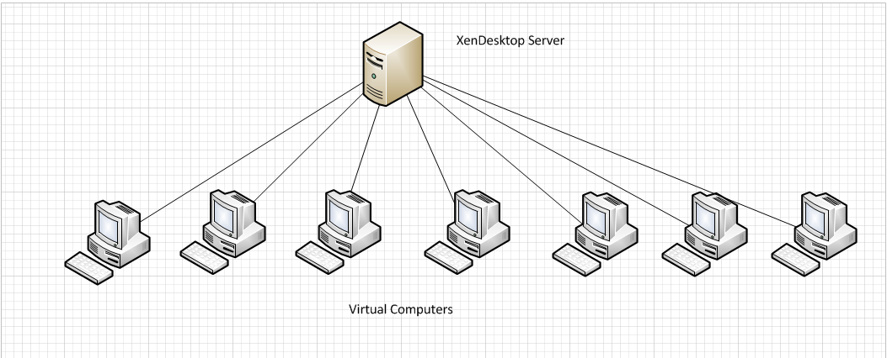
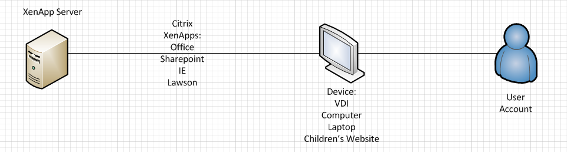
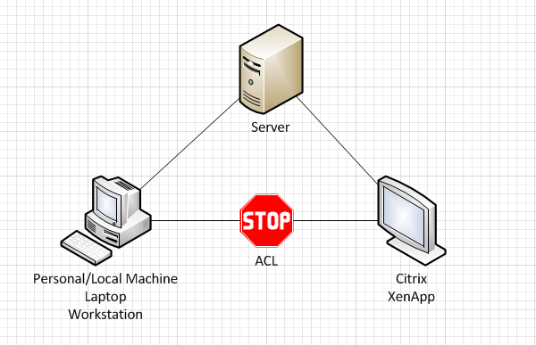
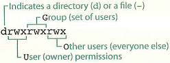

Welcome to the introductory course for computer resources here at SCRI.  This course will cover a basic introduction to the SCRI Citrix environment and also will introduce you to basic tools in linux.  If you have a bad case of CLAS (command line aversion syndrome), then this course should help you get on the road to recovery.


# Introduction to Citrix:

### What is Citrix?

Citrix is a platform for having access to programs on many different machines. This allows a user to log in to any machine on the network and continue working on their projects without having to have the program installed on every machine. This is very useful for nurses and students who move between locations a lot. But why is this imporant?

### Why Citrix?

For most here at Research you likely avoid citrix like the plague and/or don't intentionally use it because of the old thought that citrix is bad. However when needed citrix provides a steady platform of available programs to help complete most work. This includes access to email, Microsoft Office, and share drives from home. Infact you can get access to log into your local machine via the citrix applications to utilize those programs specific to your computer!

### Using Citrix safely?

Most wouldn't guess that Citrix is actually being used by just shy of everyone. Almost all of the icons on your desktop, besides a select few, are populated when citrix loads. How you access citrix and how you save what you are working on makes the difference when it comes to citrix. Knowing how to use your citix can be the difference to having an important document and having to rebuild from scratch. So we will go over some of the safest ways you can use citrix to your advantage!


#### Citrix was determined to be a useful part of this Initiative in order to more accurately familiarize you with the tools at your disposal and how to safely use them.

To start off please ensure you have completed the following:

1.	You have logged on the PDN : Directionhistoric
2.	Navigated to https://desktops.seattlechildrens.org 
3.	Logged in with Gemalto using your pin or dongle
4.	Copied the Mobaxterm mobile app to your "O:\ Drive"

Terms you might hear in this lesson are: VDI, VDS, Virtual Machine, Virtual Computer, XenDesktop, and XenApp. These are important to mention so you understand the differences.

* VDI = Virtual Device Infrastructure really meaning a hardware device that runs a virtual machine.
* VDS= Virtual Desktop Session is a session accessing software on a server.
* ACL = Access Control List Enables/Denies Communication between Computers and Servers.
* Xenapp = Server that is pushing apps to your account.
* XenDesktop = Session loaded on VDI's and when you log into https://desktops.seattlehchildrens.org/
* Virtual Machine = Virtual Computer they are equal in meaning. It is a virtual computer running on a server off in a different location.

### Diagram 1


### Diagram 2:


### Diagram 3:



Using the "O:\ Drive" or your group share as a single point of access is the safest way to save and access data because it is not only accessible everywhere you go but it is also backed up. This cannot be stressed enough!


#### __Exercise C1:__ 
1.	Open "My Citrix Computer" From the desktop and pin it to the right of the screen. We will refer to this as "Citrix"
2.	Create a file called textfile1.txt on your "O:\ Drive"
3.	Open the "Computer" by Clicking Start > Computer and pin that Window to the left of your screen.
4.	Navigate to the text document on your "O:\ Drive" in the left Window which we will call your local machine.
5.	Try and drag it from your local machine to your Citrix.
a.	(Notice how there is a Denial symbol?) This is because you cannot transfer between your Local machine and Citrix. See Diagram 3
b.	Leave both Windows open for Exercise 2.


#### __Exercise C2:__ 
1.	Lower down the "local machine" window.
2.	Open "Microsoft Outlook 2010" from your desktop. Pin it to the left side of your screen.
3.	Locate the "Dummy Email" sent to you this morning. If you did not receive it let me know.
4.	Drag the "Dummy Email" from Outlook to your "O:\ Drive" on "Citrix"
a.	(Notice how it allowed you to transfer the email there?)
5.	Open a new email and drag the text document from your "O:\ Drive" on "Citrix" to the new email.
a.	(Notice how it attached properly?)
Citrix can talk to Citrix and local can talk to local. If you have ever struggled to attach that word document or important grant to your email and had trouble it is likely that you were trying to use a mixed environment scenario.


#### __Exercise C3:__ 
1.	Open both local and Citrix windows the same way as in Exercise 1. Local on the left, Citrix on the right.
2.	Navigate to the "Desktop" on both. 
a.	(Notice that the amount of icons is different on both?)
3.	Navigate to the "O:\ Drive" on your Citrix Desktop and Copy the "New Text File1.txt" that you saved earlier.
4.	Now Navigate back to the "Desktop" in the Citrix window as before and paste the "NewTextFile1.txt" 
5.	Close out of the Citrix window.
6.	Open "My Citrix Computer" Once again and navigate to the "Desktop"
a.	(Notice how there is no text document on the desktop?)

Saving to the Citrix Desktop (the one with fewer icons), and closing out will cause you to lose what was saved there. This is because the Citrix window desktop is not actually an existing folder. Saving to the "O:\ Drive" or a department share is the single safest way to protect your data.


# Computational Resources at SCRI

The Research Informatics Team is engaged in *transforming* the way SCRI interacts with and handles big data. Part of this initiative is providing access to more scientific computing resources. The first systems to come on a line are a pair of high performance linux workstations. Keeping with the theme of "transforming research", these machines have been unofficially dubbed the Autobots, and been given the aliases Sunstreaker and Sideswiper. 

Computer Name | Alias | Memory | Processor | Cores|Primary Function
--------------|-------|--------|-----------|------|----------------
EWRLNXRD28|Sunstreaker|128 GB| Dual Intel Xeon 2.3 GHz| 40 logical| Worker nodes
EWRLNXRD29|Sideswiper|128 GB| Dual Intel Xeon 2.3 GHz| 40 logical | Worker nodes

 

# Introduction to Linux: 

### What is Linux?  

Linux is a free open sourced operating system based on Unix.  It's technically not unix, but in practice it might as well be.  Unix is like a shark of the computer world in the sense that the basic design has been around forever and is still good for what it does.  It has not changed much because people are still finding it very useful and powerful to this day.

### Why do people use it?

People like unix because it is powerful and flexible tool for efficiently getting certain kinds of work done.  This is especially true for work that has never been done before or that requires the creation of customized work flows.  If this sounds familiar that's because this is the same kind of work that people often need to do to manage data in science.  And this is why so many scientists have found linux to be a useful platform for developing new work flows.  Everyone agrees that graphical interfaces can be nice.  But the odds that you will find one that already does exactly what your experiment needs get vanishingly small starting with the moment you do anything interesting.

### How is it organized?  

There are many flavors of unix, but most of them have the same basic directory structure.  You don't need to know about a lot of it in order to use it.  But you should know a couple of things.  The 1st is that the root directory is the base for the whole system.  Unless you are the system admin or are installing software or something, you probably don't belong down there.  More commonly you want to be in your home directory.  Your home is at ~/  We will talk more about this is a minute.


# An Introduction to the command line: 

> "An elegant weapon, for a more civilized age."

The command line is the main way that professional people interact with Unix.  You might be tempted to think that something so old cannot possibly be as good as a more modern graphical interface.  But the command line demonstrates how a simpler tool can often be superior to much more complicated solutions.  


### Lets start by logging you in:

To connect to a linux machine, one of the most common tools is `ssh` or 'secure shell'. You can use `ssh` to connect to a linux machine if you have permission to do do like this:

```{bash, eval=FALSE}
ssh user@hostname
```

Normally ssh is not the first command you would teach a new student of the linux command line, but in this case we want you to use this information to log into the sunstreaker machine so that we can get started.

### The prompt

When you first log in to a linux terminal, you will see (with various levels of consternation) the __command prompt__. Like the dashboard of a car, the command prompt may look slightly different depending on the system, but in general the prompt will look something like this:

```{bash, eval=FALSE}
userid@hostname:/workingdirectory $
```
The __userid__ is the user name that is logged in to the system, in this case your SCH user id. The __hostname__ is the name of the computer you are logged into. Note that it is the real name of the computer, not the alias. Refer to the table in the Computational Resources section. The __working directory__,as the name implies, is the directory that you are currently worrking in (see the section on `pwd` below). The prompt ends with the `$` character and finally the cursor. 

One common early mistake is to assume that anytime you can see the cursor, you must be able to give the computer a command. Indeed, the system will let you type anything you want at the cursor, even if it is busy. If you do that, your command will not execute until the system finishes whatever it's last command was. You can know that the system is busy whenever you see the cursor, but not the command prompt. In other words: *unless you see the full command prompt in front of the cursor*, the system is busy and is not ready to take a command. 
 
Sometimes you may see other types of characters that look 'command prompt-ish': 

* `+` This character indicates that whatever command you entered is incomplete and the system is waiting for more information. You can either supply the missing information, or you can return to the command prompt by hitting `CTRL-c`.
* `>` or `>>>`. These characters often indicate that you have entered into a different scripting environment, such as python or R. If you find yourself with this prompt and you didn't mean to, you can return to the command prompt by hitting `CTRL-c`.


### What is tab-completion?

Before you type anything, please locate the tab key in the upper left part of your keyboard. You are going to be hitting that key a lot. That is because in Linux if you start to type something, even it you only know the first letter, you can hit the tab key for suggestions about what should come next. One hit on the tab key will complete if you have typed enough characters to narrow things down to only one solution, but two quick tabs will actually list out all remaining possibilities for you (and prompt you first if it's a large amount). Go ahead and try it! Type `pw` and then hit the tab key for suggestions about what we might do next...

### Up and down arrows, 'CTRL-a' and 'CTRL-e'

In unix, you can always get back to previous commands by hitting the up arrow.  If you step back too far, you can page the other way by hitting the down arrow.  Find yourself at the end of a very long command and want to get back to the beginning?  Hit 'CTRL-a'.  Want to get back to the end: 'CTRL-e'.

### Case sensitivity.

In Linux, the case of a letter matters. 'A' is not the same thing as 'a' etc.  So watch out for changes in case.  You will notice that some people prefer to name things using alternating lowercase and uppercase letters like this: 

```{bash, eval=FALSE}
myFile.txt
``` 
That style is called camel case.  

Other people prefer to use underscores like this:

```{bash, eval=FALSE}
my_file.txt
```

And still other people prefer all lowercase like this:

```{bash, eval=FALSE}
myfile.txt
```

Whatever style you prefer, these all have one thing in common: no spaces.  You shouldn't use white space in filenames when using linux.  You technically can do it, but everyone agrees that it's not worth it since you have to escape all your white space characters:

```{bash, eval=FALSE}
my\ file.txt
```

And this is a huge inconvenience.  So if you give someone a file like this in linux you should expect that they will probably be annoyed with you.


### Reserved Characters (also called "Special")

Like spaces, reserved characters should be avoided in file names.  Linux has two which are prohibited.  The null character, `\0` and `/` which is the path separator.  Other reserved characters are allowed but special meaning to the system like the `-` which proceeds flags on the command line or `*` which is a wild card.  Like a space, you have to escape them which adds complexity and can lead to errors if you forget. 


### Using __`pwd`__, __`/`__ and __`~/`__

If you are used to interfacing with your computer via a graphical user interface such as Finder (Mac) or Windows Explorer (PC), the concept of a __root directory__ may be somewhat vague. The root directory is simply the most inclusive folder on the system, or in other words, the folder that contains all other folders and files. When working with the command line, no matter what system you use, you can designate an absolute path by describing its location relative to root. For Window's users, each disk drive has it's own root, for example `C:`, `D:`, etc. Unix based systems, including Mac OS X and Linux, have a single root designated simply by `/`.

__root__ is not to be confused with __home__. A home directory is merely a default location to store personal account settings and user-specific files. Note however, that home is not root. In linux, your home directory is always located at `/home/username`. Because this is a common stop for so many functions, a convenient short hand is used to designate home: `~/`

When working with the command line, you will notice that your view of the filesystem is always based relative to the directory that you are currently in. So it is very important to be able to figure out where you are relative to root, how to look around and see what files and directories are nearby, and how to move yourself to different locations.

This is how you know where you are:
 
```{bash, eval=FALSE}
pwd
```
 
`pwd` means print working directory.  It will tell you where in the file system you are by giving you the full path starting with root.

As you explore around, you will notice that there are many directories contained in `root`, and you may wonder what these are for and if they are important to you. The short answer is that unless you know exactly what a directory is for, __anything outside of your home directory should probably be left alone.__ We will talk more about these directories and how you should (or should not) use them in Course 4. 


### Directories, executables and files

Directories are for storing stuff, executables do things to stuff and files are stuff.  In Linux a full directory path will start with root and end with another `/` and use more `/`'s in between as separators for each subdirectory.  On most command lines directories will be colored to indicate that they are different from the files.  And in linux most executables are stored somewhere else, so you won't normally see those unless you are invoking them as commands.


### Using __`cd`__, __`.`__ and __`..`__

`cd` means change directory.  You call that command followed by a single argument to indicate which directory you want to change to.  

`.` means here.  You use it to indicate that the path to something is where you are right now.  

And `..` means one directory up from here.

So (for example), you could change to the root directory like this:
```{bash, eval=FALSE}
cd /
```

And then you could change back to your home directory like this:
```{bash, eval=FALSE}
cd ~/
```


### Using __`ls`__

`ls` is used to list a directory.  Which directory does it list?  That would be the second argument.  For example, the following command would list the contents of the root directory

```{bash, eval=FALSE}
ls /
```

And this would list the current directory.
```{bash, eval=FALSE}
ls .
```

But in practice when people want to list the current directory, they leave out the implicit `.` like so:
```{bash, eval=FALSE}
ls
```

And when I use this command, it tends to look like this:
```{bash, eval=FALSE}
ls -alh
```
Which translates to: list the directory, but list all the files (even hidden ones), and use the long format, and make the sizes human readable.  How did I ever learn to do that?


### Using __`man`__ and __`--help`__

Well I used the man command to learn more about `ls`.  You can use the man command to pull up a manual about any linux command like this:

```{bash, eval=FALSE}
man ls
```

When you are done looking at it, hit the `q` key to exit.

Because linux is open sourced, software gets contributed from many different programmers. Sometimes, the programmers elect to not include a `man` page. An alternative route is to try the `--help` flag:

```{bash, eval=FALSE}
ls --help
```

As you can see, this returns essentially the same information.

### flags

And while we are looking at an example of some, lets talk about `flags`.  In Linux, there are special arguments called flags.  They come after the command and always follow a dash (like `-alh` above).  What they do is modify the meaning of a function.  The man page for a command should always tell you about the different flags that a command supports.


### What are permissions?

Another thing you might have noticed about my longer form use of `ls` is that it puts a string of characters in from of each file and directory.  Lets look at a toy example:

```{bash, eval=FALSE}
-rw-r--r-- 1 username rleQAS_SCRI-Sudo 8.2K Oct  7 17:21 file.txt
```

Permissions are used by Linux to control who can do things. They can be applied to (u)sers, (g)roups, (o)thers, or (a)ll.  (u)sers means the user who owns (created) the file while (g)roups mean the group that the file belongs to, and (o)thers means people who are not in these first two categories.  In Linux everything belongs to someone, so ownership and permission to act accordingly is a big deal.  Also true in Linux, is that groups of users are tracked and assigned to each file.  But each of these categories (user, group or other) can have separate permissions set to control whether people are allowed to (r)ead, (w)rite or e(x)ecute them.  Returning back to the mysterious string of ten characters mentioned above, it is actually broken into 4 sections: 



1. The very first character doesn't actually have to do with permissions.  It just indicates the kind of thing that something is. For example if it starts with `d`, then it's a directory etc.  In general, you won't need to spend a lot of time thinking about this first character.
2. The next three characters: indicate the (r)ead, (w)rite and e(x)ecute policy for the (u)ser
3. The next three characters: indicate the (r)ead, (w)rite and e(x)ecute policy for the (g)roup
4. The last three characters: indicate the (r)ead, (w)rite and e(x)ecute policy for the (o)thers

Based on this, we can see that for the file above the permissions are set to be readable and writable for the owner of this file, but only readable by others.  If you ever need to change the permissions on a file, you would do that by using the `chmod` command.  Also, you may not be allowed to change permissions for some files and directories depending on who they belong to and what kind of access priveleges __you__ have.


#### __Exercise L1:__ 

Display the working directory of your home directory.  Now look around to see if you can find the working directories for the other users.  Are you allowed to see the contents of those directories?  How do you know?


### Using __`mkdir`__

Sometimes you will need to make a new directory.  For that there is the mkdir command.
```{bash, eval=FALSE}
mkdir myDir
```

### Using __`touch`__

And sometimes you will just need to create an empty file.  Maybe later on you want to write something to it, but right now you just want to reserve that filename. For that you can use the `touch` command. Here we use touch to create a file inside of our new directory:

```{bash, eval=FALSE}
touch myDir/test.txt
```

### text editors

Linux is loaded with powerful text editors. Some of them (like vi or emacs) are so powerful that they could each have their own course.  Today lets look at a very simple and common one: `nano`.

```{bash, eval=FALSE}
nano myFile.txt
```

That command will launch the nano editor.  Once inside you will be able to type in text of interest.  When you want to leave you can look at the bottom of the screen and you will see commands abbreviated like this: ^X 

`^X` basically means 'CTRL-X'.  It's a hint about how to give that command.  Do it now to exit out of nano and feel free to save your work on the way.


***
***
***


### __Answers for Exercises__

Here you can find answers to the questions posed above.   


##### __Answer for Question L1:__

Display the contents of your home dir:

```{bash, eval=FALSE}
cd ~/
ls
```

Find where other home dirs are located:
```{bash, eval=FALSE}
pwd
cd ..
ls
```

Are you allowed to see other working directories?

```{bash, eval=FALSE}
ls -l
```
No: the permissions prevent this


